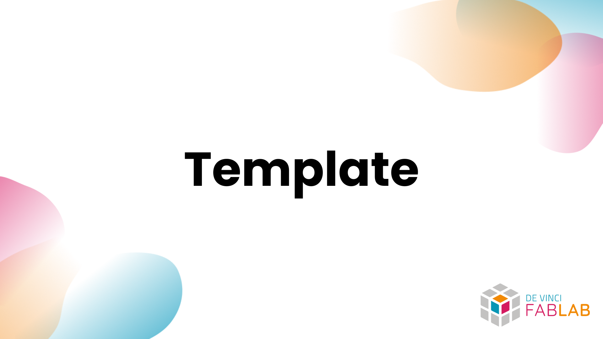

## Overview

> Add a short description of the project here.

Add important information about the project here.

## Getting Started

- [Overview](#overview)
- [Getting Started](#getting-started)
  - [Documentation](#documentation)
  - [Setting up](#setting-up)
    - [Prerequisites](#prerequisites)
    - [Install](#install)
    - [Build \& Run](#build--run)
    - [Usage](#usage)
  - [Troubleshooting](#troubleshooting)
  - [Supported platforms](#supported-platforms)
  - [Supported languages](#supported-languages)
  - [Future improvements](#future-improvements)
  - [Contributing](#contributing)
  - [License](#license)

### Documentation

Provide where to find to the documentation of the project. (ex: [Structure of the project](./docs/STRUCTURE.md))

It may include a link to an important [reference](https://example.com).

### Setting up

#### Prerequisites

- Define tools and libraries that are required to run the project with the version number.
- If available, provide a link to the installation guide.
- You may also add concepts or knowledge that are required to understand the project.

#### Install

Details here explicit instructions to install the project.

Here are the info blocks available for github markdown:

> [!NOTE]
> Do not hesitate to add a note if necessary.

> [!TIP]
> Do not hesitate to add a tip if necessary.

> [!WARNING]
> Do not hesitate to add a warning if necessary.

> [!IMPORTANT]
> Do not hesitate to add an important note if necessary.

> [!CAUTION]
> Do not hesitate to add a caution if necessary.

#### Build & Run

Detail here the instructions to build and run the project.

#### Usage

Detail here the instructions to use the project.

### Troubleshooting

Detail here the troubleshooting of the project.

### Supported platforms

- Precise here the platforms that are supported by the project.
- If available, provide a link to the installation guide.
- If in testing, do not hesitate to mention it.

### Supported languages

- Precise here the languages that are supported by the project.
- If necessary, precise if some languages needs to be checked.

### Future improvements

- Precise here the future improvements that are planned for the project.
- ~~Imporvement done can be styled like this.~~

### Contributing

If you want to contribute to the project, you can follow the steps described in the [CONTRIBUTING](./.github/CONTRIBUTING) file.

Deployment guidelines are available in the [DEPLOYMENT](./docs/DEPLOYMENT.md) file.

### License

This project is licensed under the MIT License, which grants you the freedom to:

- Use the software for any purpose (commercial or personal)
- Modify and distribute the software
- Include it in proprietary software
- Sell copies of the software

The only requirement is to include the original copyright notice and license terms in any copy or substantial portion of the software.

For complete license terms and conditions, see the [LICENSE](LICENSE) file for details.
