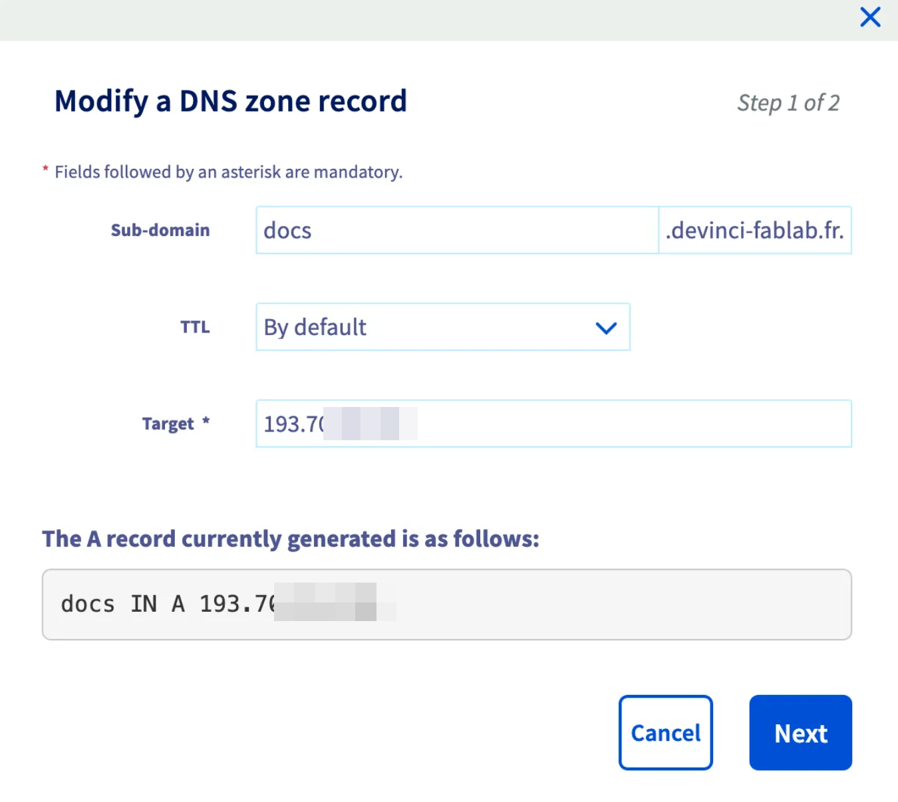

# Deployment Manifest

## Overview

This document outlines the setps, requirements and configurations needed to deploy and maintain applications in the DeVinci Fablab environment. Following these guidelines will ensure a consistent and efficient deployment process.

## Docker volume

> Docker volumes are gathered in a single directory to ease management and backup. The path is defined in the environmnent of the server under the variable `VOLUMES_PATH`.

Here is an example of how to use the `VOLUMES_PATH` in a `compose.yml` file for your services:

```yaml

services:
    your-service:
    image: ...
    ...
    volumes:
        - ${VOLUMES_PATH}/your_service_name/volume1:/my/volume1
        - ${VOLUMES_PATH}/your_service_name/volume2:/my/volume2
```

> [!NOTE]
> The advantage of using a variable like `VOLUMES_PATH` not managed by the end user is that it allows for easy changes to the volume path without needing to modify each individual service's configuration.

## CD pipeline

### Dockerfile

> The Dockerfile is the blueprint for building your application image. It should be placed under the `docker/` directory of your service. The Dockerfile should be named `Dockerfile` and follow best practices for Docker image creation.

Here is an example using several interesting features:

```dockerfile
# Stage 1: Base image.
FROM node:slim AS base
## Enable corepack as root first
RUN corepack enable
## Set the working directory to `/app`.
WORKDIR /app
## Disable colour output to make logs easier to read.
ENV FORCE_COLOR=0

# Stage 2a: Development mode.
FROM base AS dev
## Set the working directory to `/app`.
WORKDIR /app
## Expose the port that Docusaurus will run on.
EXPOSE 3000
## Create startup script
COPY ./docker/dev-startup.sh /dev-startup.sh
RUN chmod +x /dev-startup.sh
## Run the development server using the startup script
CMD ["/dev-startup.sh"]

# Stage 2b: Production build mode.
FROM base AS prod
## Copy over the source code from site directory.
COPY ./site/ /app/
## Install dependencies with `--frozen-lockfile` to ensure reproducibility.
WORKDIR /app
RUN pnpm install --frozen-lockfile --force
## Build the static site.
RUN pnpm build

# Stage 3a: Serve with `docusaurus serve`.
FROM prod AS serve
## Expose the port that Docusaurus will run on.
EXPOSE 3000
# Before copying the healthcheck script
RUN apt-get update && apt-get install -y curl wget && apt-get clean
## Copy healthcheck script
COPY ./docker/healthcheck.sh /healthcheck.sh
RUN chmod +x /healthcheck.sh
## Add health check to verify the service is running properly
HEALTHCHECK --interval=30s --timeout=10s --start-period=90s --retries=3 \
    CMD /healthcheck.sh
## Run the production server.
CMD ["pnpm", "serve", "--host", "0.0.0.0", "--port", "3000", "--no-open"]
```

Let's break down the Dockerfile into the different features used:

- **Multi-stage builds**: This Dockerfile uses multi-stage builds to separate the development and production environments. The `base` stage sets up the common environment, while `dev` and `serve` stages handle development and production respectively. That way, we can build the image using the same Dockerfile but now we can specify which target stage to build.
- **EXPOSE** keyword: The `EXPOSE` keyword is used to **document** (only, it does not really do something) the port that the application will run on.
- **"--port", "3000"**: It is very important to specify the port that the application will run on, as it is used by the healthcheck script and the Traefik configuration to route traffic correctly.
- **COPY ./site/ /app/**: For the production stage, we copy the source code from the `site` directory into the `/app/` directory in the container. This step will ensure that our container will work as a standalone service, and will not need to rely on a volume to access the source code.
- **HEALTHCHECK**: The `HEALTHCHECK` instruction is used to define a health check for the service. It specifies how to check if the service is running properly, and how often to perform the check. In this case, it runs the `healthcheck.sh` script every 30 seconds, with a timeout of 10 seconds, and a start period of 90 seconds.

### Healthcheck script

> The healthcheck script is used to verify that the service is running properly. It should be placed under the `docker/` directory of your service and named `healthcheck.sh`. The script should be executable and perform a simple check to ensure the service is responsive.

Here is an example of an effective healthcheck script used for the former Docusaurus service:

```bash
#!/bin/bash

# Set variables
HOST="0.0.0.0"
PORT="3000"
TIMEOUT=5
URL="http://${HOST}:${PORT}/"

echo "Performing health check on ${URL}..."

# Use wget if available, otherwise try curl
if command -v wget &> /dev/null; then
  if wget --spider --quiet --timeout=$TIMEOUT $URL 2>/dev/null; then
    echo "Health check passed: Service is up!"
    exit 0
  else
    echo "Health check failed: Service is down!"
    exit 1
  fi
# Fallback to curl
elif command -v curl &> /dev/null; then
  if curl --output /dev/null --silent --fail --max-time $TIMEOUT $URL; then
    echo "Health check passed: Service is up!"
    exit 0
  else
    echo "Health check failed: Service is down!"
    exit 1
  fi
else
  echo "Health check failed: Neither wget nor curl is available!"
  exit 1
fi
```

### CD.yml

> The `CD.yml` file is used to define the continuous deployment pipeline for your service. It should be placed under the `.github/workflows/` directory of your service. The file should follow the GitHub Actions syntax and include steps for building, testing, and deploying your application. The main objective of this one specifically, will be to build the Docker image and push it to the registry of GitHub to we available everywhere.

Here is an example of a `CD.yml` file that builds the Docker image and pushes it to the GitHub registry:

```yaml
name: Build and Push Docker Image

on:
  push:
    branches:
      - main

permissions:
  contents: read
  packages: write

jobs:
  build-and-push-image:
    runs-on: ubuntu-latest
    steps:
      - uses: actions/checkout@v3

      - name: Log in to the Container registry
        uses: docker/login-action@v2
        with:
          registry: ghcr.io
          username: ${{ github.repository_owner }}
          password: ${{ secrets.GITHUB_TOKEN }}

      - name: Build and push Docker image
        uses: docker/build-push-action@v4
        with:
          context: .
          file: docker/Dockerfile
          target: serve
          push: true
          tags: |
            ghcr.io/devinci-fablab/documentation:latest
            ghcr.io/devinci-fablab/documentation:${{ github.sha }}
          build-args: |
            VERSION=${{ github.ref_name }}
            BUILD_DATE=$(date -u +'%Y-%m-%dT%H:%M:%SZ')
```

The meaningful part for us and the only one to change from service to service will be this one:

```yaml
- name: Build and push Docker image
  uses: docker/build-push-action@v4
  with:
    context: .
    file: docker/Dockerfile
    target: serve
    push: true
    tags: |
      ghcr.io/devinci-fablab/documentation:latest
      ghcr.io/devinci-fablab/documentation:${{ github.sha }}
    build-args: |
      VERSION=${{ github.ref_name }}
      BUILD_DATE=$(date -u +'%Y-%m-%dT%H:%M:%SZ')
```

The key aspects to note here are:

- **file**: Be sure that the Dockerfile is correctly referenced, in this case it is under the `docker/` directory.
- **target**: This specifies which target stage to build from the Dockerfile. The target should always be a production stage only, or none if you did not use multi-stage builds.
- **tags**: This is where you specify the tags for the image. The first tag is usually the latest version, and the second one is a unique identifier based on the commit SHA. The format of the tags should be `ghcr.io/devinci-fablab/<service_name>:<tag>`, where `<service_name>` is the name of your service (no spaces, special characters, or uppercase letters) and `<tag>` is the version or commit SHA (latest, stable, or a specific version number).

### Docker compose and multiple targets

> The `compose.yml` file is used to define the services, networks, and volumes for your application. It should be placed at the root of your service directory. The file should follow the Docker Compose syntax and include the necessary configurations for your service.

As we tackled the multi-stage builds in the Dockerfile, we can now use the `compose.yml` file to define different targets for the building of the image for development and production:

```yaml
services:
  # Development service with hot-reloading
  docusaurus-dev:
    build:
      context: .
      dockerfile: docker/Dockerfile
      target: dev
    restart: unless-stopped
    ports:
      - '3000:3000'
    volumes:
      - ./site:/app
    environment:
      - NODE_ENV=development

  docusaurus-prod-local:
    build:
      context: .
      dockerfile: docker/Dockerfile
      target: serve
    restart: unless-stopped
    ports:
      - '3000:3000'
    environment:
      - NODE_ENV=production

  # Production service
  docusaurus-prod:
    image: ghcr.io/devinci-fablab/documentation:latest
    restart: unless-stopped
    environment:
      - NODE_ENV=production
    security_opt:
      - no-new-privileges:true
```

> [!NOTE]
> You may also have noticed that the image for the production service is specified as `ghcr.io/devinci-fablab/documentation:latest`. This is the image that will be pulled from the GitHub Container Registry, which is built and pushed by the `CD.yml` pipeline we defined earlier. I will be the only one used by the server, the other are only for local development and testing purposes.
>
> In addition, we have added a `security_opt` option to the production service. This is a security measure to prevent privilege escalation attacks by disallowing the container from gaining new privileges.

## Traefik integration

> Traefik is used as a reverse proxy to route traffic to the appropriate service based on the domain name. It is configured to work with Docker and will automatically detect new services and route traffic accordingly.

Our former configuration was in fact incomplete, because no ports where defined, no labels were set and the service was not on the same network as Traefik (meaning they could not communicate with each other). Here is an example of how to configure Traefik to work with your service:

```yaml
services:
  # Development service with hot-reloading
  docusaurus-dev:
    build:
      context: .
      dockerfile: docker/Dockerfile
      target: dev
    restart: unless-stopped
    ports:
      - '3000:3000'
    volumes:
      - ./site:/app
    environment:
      - NODE_ENV=development

  docusaurus-prod-local:
    build:
      context: .
      dockerfile: docker/Dockerfile
      target: serve
    restart: unless-stopped
    ports:
      - '3000:3000'
    environment:
      - NODE_ENV=production

  # Production service
  docusaurus-prod:
    image: ghcr.io/devinci-fablab/documentation:latest
    restart: unless-stopped
    environment:
      - NODE_ENV=production
    deploy:
      mode: replicated
      replicas: 2
    security_opt:
      - no-new-privileges:true
    labels:
      - 'traefik.enable=true'
      - 'traefik.http.routers.documentation.rule=Host(`docs.devinci-fablab.fr`)'
      - 'traefik.http.routers.documentation.entrypoints=websecure'
      - 'traefik.http.routers.documentation.tls.certresolver=myresolver'
      - 'traefik.http.services.documentation.loadbalancer.server.port=3000'
      - 'com.centurylinklabs.watchtower.enable=true'
    networks:
      - traefik-network

networks:
  traefik-network:
    external: true
```

### Labels

> [!WARNING]
> In all these labels, be sure to replace `documentation` with the name of your service (no spaces, special characters, or uppercase letters). This name will be used by Traefik to route traffic to your service (ex: `speedtest`, `portfolio`, ...). It has to be unique across all services.

`- 'traefik.enable=true'` enables Traefik for this service, allowing it to route traffic to it.

`- 'traefik.http.routers.documentation.rule=Host(`docs.devinci-fablab.fr`)'` defines the routing rule based on the host header. This means that any request to `docs.devinci-fablab.fr` will be routed to this service.

> [!WARNING]
> Be sure to replace `docs.devinci-fablab.fr` with the actual domain name you want to use for your service. This should be a valid domain that points to your **server's IP address**.
>
> 

`- 'traefik.http.routers.documentation.entrypoints=websecure'` specifies the entry point for the router, which is usually defined in the Traefik configuration.

`- 'traefik.http.routers.documentation.tls.certresolver=myresolver'` enables TLS for this router and specifies the certificate resolver to use for obtaining certificates.

`- 'traefik.http.services.documentation.loadbalancer.server.port=3000'` tells Traefik which port the service is listening on inside the container. Change this to the port your application is running on, which should match the `EXPOSE` directive in your Dockerfile.

> [!NOTE]
> In production mode, do not set the `ports` directive in the `compose.yml` file, as Traefik will handle the routing and port mapping for you. The `ports` directive is only used for development purposes to expose the service on a specific port. In reality, setting up port like this with a firewall will override the defined rules which should not be intended. [Read more](https://www.baeldung.com/linux/docker-container-published-port-ignoring-ufw-rules)

### Watchtower label

> Watchtower is a tool that automatically updates running Docker containers when a new image is available. It can be configured to monitor specific services and update them without manual intervention.

`- 'com.centurylinklabs.watchtower.enable=true'` enables Watchtower for this service, allowing it to be automatically updated when a new image is available.

### Network

We added the `networks` section to the service definition to ensure that the service is on the same network as Traefik. This allows Traefik to communicate with the service and route traffic to it.

```yaml
networks:
  - traefik-network
```

As this is only a reference to an external network, you need to specify it:

```yaml
networks:
  traefik-network:
    external: true
```

### Replicas

> The `deploy` section is used to define the deployment configuration for the service. It allows you to specify the number of replicas, update strategies, and other deployment-related settings.

```yaml
deploy:
  mode: replicated
  replicas: 2
```

This configuration specifies that the service should be deployed in replicated mode with 2 replicas. This means that there will be 2 instances of the service running, providing redundancy and load balancing from Traefik.
